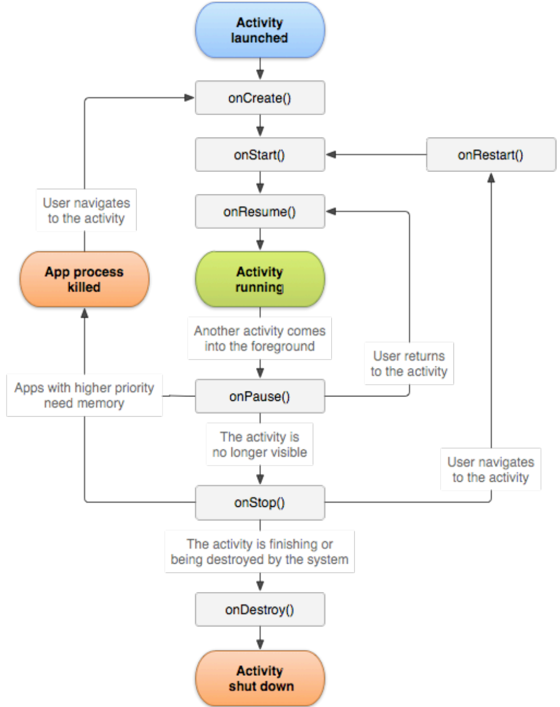
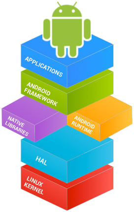

# Einleitung

Zusammenfassung für das Modul MOBPRO an der HSLU (FS19).

## Warum Android


* Android ist die meistgenutze mobile Plattform (~87%)
* Kompletter Stack: OS, Middleware, Applikationen
* Entwickelt von der _Open Handheld Alliance_, geführt von Google

# Grundlagen einer Android Applikation

## Komponenten

Android Applikationen sind zusammengesetzt aus lose gekoppelten Komponenten. Dies können eigene oder Komponenten von anderen Applikationen sein.

Die *Android Runtime* verwaltet die Applikationen, bzw. einzelnen Komponenten einer Applikation.

Mit dem *Intent*-Mechanismus kann eine Komponente eine andere aufrufen. Dies kann auf zwei Arten geschehen:

* **Explizite Intents**: Komponente wird direkt adressiert
* **Implizite Intents**: Geeigneter Empfänger wird beschrieben (_take a photo_, _view image_). Das System liefert dann eine passende Komponente.

Beispiel expliziter Intent:

```java
// Sender Activity
public void onClickSendBtn(final View btn) {
  // explicit receiver
  Intent intent = new Intent(this, Receiver.class);
  intent.putExtra("msg", "Hello World");
  startActivity(intent);
}
```

```java
// Receiver Activity
public void onCreate(Bundle savedInstanceState) {
  Intent intent getIntent();
  String msg = intent.getExtras().getString("msg");
}
```

Beispiel impliziter Intent:

```java
// Sender Activity
Intent browserCall = new Intent();
browserCall.setAction(Intent.ACTION_VIEW);
// implicit call: looking for a component that can open URLs
browserCall.setData(Uri.parse("https://hslu.ch");
startActivity(browserCall)
```

Das System verwaltet den Lebenszyklus von Komponenten:

* _started_
* _paused_
* _active_
* _stopped_

Es gibt vier Typen von Android Komponenten:

 Name | Beschreibung
--- |---
*Activity* | UI-Komponente, UI-Komponente, entspricht typischerweise einem Bildschirm
*Service* | Komponente ohne UI, läuft typischerweise im Hintergrund
*Broadcast Receiver* | Reagiert auf app-interne oder systemweite Nachrichten
*Content Provider* | Ermöglicht Datenaustausch zwischen Applikationen

### Acivity

Eine Activity (`android.app.Activity`) entspricht normalerweise einem Screen und stellt UI-Widgets wie Labels und Buttons dar und reagiert auf Benutzereigaben. Eine App besteht in der Regel aus mehreren Activities, die auf einem Stack liegen.

```java
public class DemoActivity extends Activity {
  // Called when  the activity is first created
  public void onCreate(Bundle savedInstanceState) {
    super.onCreate(savedInstanceState);
    setContentView(R.layout.main);
  }
}
```

### Service

Ein Service (`android.app.Service`) läuft für unbeschränkte Zeit und typischerweise im Hintergrund und haben keine grafisches UI. Beispielsweise ein Musikplayer oder ein Dateidownload.

### Broadcast Receiver

Broadcast Receiver (`android.content.BroadcastReceiver`) erhalten systemweite oder interne Nachrichten des Apps und reagieren darauf.

### Content Provider

Content Provider (`android.content.ContentProvider`) bieten Standard-APIs zum Erstellen, Suchen, Löschen und Einfügen von Daten an. Zum Beispiel: Zugriff auf das Adressbuch, SMS, etc.

## Android Manifest

Alle Komponenten einer Applikation müssen dem System bekannt sein. In der Datei `AndroidManifest.xml` befinden sich Informationen zu den Komponenten mit *Privileges*, *Permissions* und Einschränkungen (*Intent-Filter*).

```xml
<activity android:name=".Sender" />
<activity android:name=".Receiver" />
```

Die Datei beinhaltet grundsätzlich die statischen Eigenschaften einer Applikation wie Java-Package Name, Rechte und die Deklaration aller Komponenten.

Beispiel `AndroidManifest.xml`:

```xml
<?xml version="1.0" encoding="utf-8"?>
<manifest xmlns:android="http://schemas.android.com/apk/res/android"
    package="com.example.helloworld">

    <application
        android:allowBackup="true"
        android:icon="@mipmap/ic_launcher"
        android:label="@string/app_name"
        android:roundIcon="@mipmap/ic_launcher_round"
        android:supportsRtl="true"
        android:theme="@style/AppTheme">
        <activity android:name=".MainActivity">
            <intent-filter>
                <action android:name="android.intent.action.MAIN" />

                <category android:name="android.intent.category.LAUNCHER" />
            </intent-filter>
        </activity>
    </application>

</manifest>
```

## Lebenszyklus einer App

Das System regelt den Lebenszylus von Applikationen und kann diese selbständig terminieren und neu starten, um Ressourcen zu sparen. Applikationen können also ihren Lebenszyklus nicht selber kontrollieren und müssen daher in der Lage sein ihren Zustand zu persistieren.



## Struktur eines Android Projekts

```tree
.
├── app
│  ├── manifests
│  │  └── AndroidManifest.xml
│  ├── java
│  ├── res
│  │  ├── drawable (Pictures)
│  │  ├── layout
│  │  ├── menu
│  │  └── value
│  └── Gradle Scripts
└── build
```

* `manifests`: Statische Definition der App: Komponenten, Permissions etc.
* `java`: Java-Code: Activities etc.
* `res`: Alle Teile des Apps, die nicht Java-Code sind.
  * `drawable`: Bilder
  * `layout`: Layout-Definitionen (XMLs)
  * `value`: Array-Werte, Colors, Strings etc.
  * ...

*Beispiel: Referenzierung von Ressourcen in Layout XML:*

```xml
<TextView
  ...
  android:background="@color/sectionBackground“
  android:textColor="@color/sectionText"
  android:text="@string/main_section1"
/>
```

# Das Android Betriebssystem

- **Linux Kernel**: Drivers (USB, WiFi, Audio, Display), Power Management
- **Hardware Abstraction Layer (HAL)**: Audio, Bluetooth, Camera, Sensors
- **Native C/C++ Libraries** && **Android Runtime (ART)**
- **Java API Frameworks**: Content Providers, Activity, Notification
- **System Apps**: Calendar, Camera, Email

## Andoid Stack

1. *Linux Kernel*: OS, FS, Drivers
2. *HAL (Hardware Abstraction Layer)*: Abstraktion von Kamera, Sensoren, ...
3. *Native Libraries (C/C++)*
4. *ART (Android Runtime)*
5. *Android Framework*: Android Java API
6. *Applications*



## Security Konzept

Sandbox:

* Jede Applikation hat einen eigenen Prozess, Benutzer, ART-Instanz, Heap und Dateisystembereich
* Benutzerbasierte Berechtigungen (eigener Linux Benutzer für jedes App)
* Signieren von Anwendungen
* Berechtigungen im Android Manifest

# Layout

Das GUI wird in der Regel als XML spezifizert. In der Activity wird bei der Erstellung das Layout angegeben:

```java
setContentView(R.layout.activity_main);
```

## Views und ViewGroups

Ein Android UI ist hierarchisch aufgebaut und besteht aus _ViewGroups_ und _Views_ (Widgets).

Views und Viewgroups können _statisch_ (im XML) oder _dynamisch_ im Java-Code definiert werden. In der Regel wird das GUI statisch definert und einzelne Element dynamisch ein- oder ausgeblendet.

Damit ein GUI-Element im Code verwendet werden kann, muss im Layout eine ID definiert sein:

```xml
<TextView
  android:id="@+id/section_text"
  ...
/>
```

Das Element kann dann über die ID gefunden werden:

```java
TextView label = (TextView) findViewById(R.id.section_text);
label.setText("Hello Android");
```

### Constraint Layout

Ein _Constraint Layout_ ist ein Layout-Element zur relativen Platzierung von Elementen mit Bedingungen, welche die Position relativ zu anderen Elenemten definieren (Constraints).


### Linear Layout

Mit Lineare Layouts können Elemente horizontal oder vertikal aufgereiht werden, wie beispielsweise Button- oder Action-Bars.

Das Linear Layout ist einfacher zu handhaben und robuster als das Constraint Layout und eignet gut sich für sehr einfache Screens.

### ScrollView

_ViewGroup_, die vertikales Scrolling erlaubt. Eine ScrollView kann nur ein Element enthalten, beispielsweise eine ListView.

### Adapter View

_Adapter_ sind Verbindung zwischen Datenquelle und GUI. Erzeugt pro Datenelement ein View-Element.

_AdapterViews_ sind spezielle Views, die für die Verwendung zusammen mit Adaptern optimiert sind (`ListView`, `GridView`, `Gallery`, `Spinner`, `Stack`, etc.)

Beispiel ArrayView:

```java
String spiceArray new String[]{
  "scary", "sporty", "baby", "ginger", "posh"
};
ArrayAdapter<String> adapter =
  new ArrayAdapter<String>(
    this,
    android.R.layout.simple_list_item_checked,
    spiceArray
  );
this.setListAdapter(adapter);
```

## Pixelangaben

* `dp`: _Density-independent Pixels_: Abstrakte Einheit basierend auf der Dichte des Bildschirms.
* `sp`: _Scale-independent Pixels_: Ähnlich wie _dp_, aber skaliert nach der vom Benutzer eingestellten Schriftgrösse.
* `px`: _Pixels_

# GUI

## GUI-Events

Nach dem Observer/Listener Pattern:

```java
Button button = (Button) findViewById(R.id.example_button);
button.setOnClickListener(new OnClickListener() {
  @Override
  public void onClick(View v) {
    // handler code
    doStuff();
  }
});
```

Alternativ können onClick-Event Listener auch im XML registriert werden:

```xml
<Button
  andoroid:id="@+id/example_button
  android:onClick="doStuff"
```

Die Signatur der im XML definierten Funktion ist Vorgegeben:

```java
public void name(View v)
```

## ViewModel

Bei jedem Konfigurationswechsel (Sprache, Layout, Orientierung etc.) wird die aktuelle Activity-Instanz zerstört und neu aufgebaut. Dadurch gehen Daten (Undo-Cache, Dropdown-Auswahl, Logs etc.) verloren.

Mit einem ViewModel werden UI-Daten so abgekapselt, dass Sie bei einer Konfigurationsänderung im Memory erhalten bleiben.

*Beispiel Counter mit ViewModel:*

```java
// View Model
public class MainViewModel extends ViewModel {
  private int counter = 0;
  public int incrementCounter() { return ++counter; }
  public int getCounter() { return counter; }
}
```

```java
// Main Activity
public void onCreate(Bundle savedInstanceState) {
  super.onCreate(savedInstanceState);
  setContentView(R.layout.activity_main);
  viewModel = ViewModelProviders.of(this).get(MainViewModel.class);

  counterLabel = findViewById(R.id.main_label_counter);
  updateCounterLabel();
}

public void increaseCounter(View button) {
  viewModel.incrementCounter();
  updateCounterLabel();
}
```

## Rückmeldung an den Benutzer

### Toast

Popup für kurze Rückmeldungen, keine Interaktion möglich, verschwindet nach kurzer Zeit wieder.

```java
Toast.makeText(
  getApplicationContext(),
  "Hello Toast",
  Toast.LENGTH_LONG
).show();
```

### Dialoge

Fenster mit Aktion für Benutzer mit Buttons für positive, negative und neutrale Antwort.

### Notifications

Notifications sind kurze nachrichten in der Status-Bar. Bleiben erhalten. bis sie vom Benutzer quittiert werden.

# Permissions

Gewisse Aktionen benötigen vom Benutzer erteilte Permissions (Zugriff auf Kamera, Kontakte, SD-Karte etc.). Erforderliche Permissions werden im Manifest deklariert.

```xml
<manifest
  package="ch.hslu.mobpro.persistency"
  xmlns:android="http://schemas.android.com/apk/res/android">

  <uses-permission android:name="android.permission.READ_EXTERNAL_STORAGE" />
  <uses-permission android:name="android.permission.WRITE_EXTERNAL_STORAGE" />
  <uses-permission android:name="android.permission.READ_SMS" />
  <uses-permission android:name="android.permission.WRITE_SMS" />

```

Permissions werden unterteilt in:

* `normal`: Erlaubnis wird bei Installation erteilt
* `dangerous`: Muss vom user erlaubt werden und kann wieder entzogen werden
* `signature`: Automatisch erlaubt, wenn die beiden kommunizierenden Apps vom gleichen Hersteller sind, sonst wie `dangerous` 
* `signatureOrSystem`: Automatisch erlaubt, für Apps im System-Image sind, sonst wie `signature`. (Z.B. Internetzugriff)

# Persistenz

## Shared Preferences

Persistente Einstellungen für eine Activity oder eine Application als Key-Value-Store.

**Beispiel:**

```java
// Zugriff auf shared preferences
final SharedPreferences pref = getPreferences(MODE_PRIVATE);
// Lesen
final int newCount = preferences.getInt(COUNTER_KEY, 0) + 1;
// Schreiben
final SharedPreferences.Editor editr = preferences.edit();
editor.putInt(COUNTER_KEY, newCount);
editor.apply();
```

## Dateisystem

Typische Einsatzbereiche des Dateisystems sind:

- Speichern und Laden von binären Dateien: Bilder, Musik, Video, serialisierte Java-Objekte
- Caching von heruntergeladenen Dateien
- Grosse Textdateien, JSON, XML
- Teilen und Freigeben von erstelltem Inhalte
- Externer Speicher (SD-Karte)

Jede App verfügt über ein eigenes Applikationsverzeichnis, auf das von anderen Apps nur via Content Provider zugegriffen werden kann. Daten auf der SD-Karte sind öffentlich und für alle Apps zugreifbar.

```java
// private
Context.getFIlesDir()
// public
Environment.getExternalStorageDirectory()
Environment.getExternalStorageState();
```

Der Zugriff auf die SD-Karte bedingt aber eine Permission im Manifest:

```xml
<manifest
  package="ch.hslu.mobpro.persistency"
  xmlns:android="http://schemas.android.com/apk/res/android">

  <uses-permission android:name="android.permission.WRITE_EXTERNAL_STORAGE" />
```

## Datenbank (Room)

Android enthält SQLite, welches direkt oder mit dem Android OPRM _Room_ verwendet werden kann. Room besteht aus drei Komponenten:

* _Database_: Abstraktion der Datenbankverbindung
* _Entity_: Repräsentation einer Tabelle in der relationalen DB
* _DAO_: Data Access Object, enthält Methoden für den Datenzugriff
  
*Beispiel Instanzierung einer Room-DB*:

```java
// Konfiguration
@Database(entries = {User.class}, version = 1)
public abstract calss AppDatabase extends RoomDatabase {
  public abstract UserDao userDao();
}
```

```java
// Instanz erzeugen
AppDatabase = db = Room.databaseBuilder(
  getApplicationContext(),
  AppDatabase.class,
  "database-name"
).build();
```

*Beispiel Entity POJO mit Annotationen*:

```java
@Entity
public class User {
  @PrimaryKey(autoGenerate = true)
  public int uid;

  @ColumnInfo(name="user_name")
  public String userName;

  @Ignore
  String password;
}
```

*Beispiel DAO mit SQL Queries*:

```java
@Dao
public interface UserDao {
  // mit SQL Queries
  @Query("SELECT * FROM user")
  List<User> getAll();

  @Query("SELECT * FROM user WHERE uid IN (:userIds)")
  List<User> loadAllByIds(int[] userIds);

  // Convinence Quereis
  @Insert(onConflict = OnConflictStrategy.REPLACE)
  void insertAll(User... users);

  @Delete
  void delete(User user);
}
```

# Content Providers

Stellen Daten für andere Applikationen bereit, Zugriff erfolgt über URI. Zum Beispiel:

```url
content://hslu_notes/notes/4
```

## Standard Content Providers

Das Android System stellt bereits einige Content Providers zur Verfügung:

* Kontakte
* SMS / MMS
* Media Store
* Settings
* Kalender

## Zugriff auf Content Provider

Der Zugriff auf einen Content Provider erfolgt über einen _Content Resolver_:

```java
Context.getContentResolver()
```

# Nebenläufigkeit

Eine Android Applikation läuft standardmässig in einem einzigen Thread, dem _main_-Thread. In diesem wird das ganze UI aufgebaut. Wenn der main-Thread blockiert ist, friert das UI ein.

Da Netzwerkmethoden, Datenbankzugriffe und andere Aktionen lange dauern können, sollten diese nicht auf dem main-Thread verwendet werden, da sonst sonst das UI blockiert wird.

Aus diesem Grund sind gewisse Operationen wie beispielsweise Netzwerkzugriffe auf dem main-Thread nicht erlaubt und führen zu einer Exception.

## Android-Überwachung

Das Android System überwacht die Responsivness von Apps. Falls innerhalb von 5 Sekunden keine Reaktion auf einen Input-Event erfolgt, kann ein ANR-Dialog (ANR = _Application Not Responding_) zum Schliessen der App eingeblendet werden.

## Nebenläufigkeit mit `AsynchTask`

Eine Klasse, die von `AsynchTask` erbt kann mit `AsyncTask.doInBackground()` gewisse Sachen auf einen Worker-Thread ausführen.

Je nach Implementation sind das einer oder mehrere Worker-Tasks.
Andere Methoden (z.B. `AsynchTask.onProgressExecute()`) laufen auf dem main-Thread.

```java
class MyAsyncTask extends AsynchTask<Params, Progress, Result> {
  protected Result doInBackground(Params... params)
  protected void onProgressUpdate(Progress... progress)
  protected void onPostExecute(Result result)
  public void execute(Params... params)
}
```

* `Params`: Typ der Input-Elemente
* `Progress`: Typ der Zwischenresultate
* `Result`: Typ des Resultats

## Nebenläufigkeit mit Java-Threads

Nebenläufigkeit in Android kann auch mit dem `Runnable`-Interface realisiert werden.

# Kommunikation über HTTP

Die Kommunikation mit einem Server-Backend erfolgt in der Regel über eine (REST) HTTP-API statt. Das Datenformat ist meist JSON oder seltener XML.

## Repetition HTTP

* Zustandsloses Kommunikationsprotokoll
* Transport über TCP/IP
* Request/Response Muster
  * Anfragemethoden: GET, PUT, POST, DELETE
* Nachricht besteht Header und Body
  * Header: Key-Value Paare
  * Body: Beliebiger Content / Text
* Statuscode mit jeder Antwort

Unverschlüsselte Kommunikation über HTTP ist seit Android 9 standardmässig unterbunden und muss bei Bedarf aktiviert werden.

Relevante Berechtigungen (Manifest):

```xml
<uses-permission android:name="android.permission.INTERNET">
<uses-permission android:name="android.permission.ACCESS_NETWORK_STATE">
```

Das Absetzen von HTTP-Requests mit Java und das Parsen von JSON von Hand ist relativ mühsam. Deshalb besser Libraries verwenden:

* Http-Client: http://square.github.io/okhttp/
* JSON-to-Java-Mapper: Gson
* Backend abstrahieren:  https://square.github.io/retrofit/

# Service-Komponente

Services wurden ursprünglich zur Kapselung und Erledigung von Hintergrundarbeiten eingeführt. Aus Performancegründen wurden Services aber stark eingeschränkt und sollte nur noch als Foreground-Service verwenden werden (z.B. Musikplayer).

## Foreground Service

Benötigt Permission `FOREGROUND_SERVICE`.

```java
public class DemoMusicPlayerSerivce extends Service {
  
  @Override
  public int onStartCOmmand(Intent intent, int flags, int startId) {
    startPlayer();
    return Service.START_NOT_STICKY; // in main thread
  }

  private void startPlayer() {
    if (playThread != null && playThread.isAlive()) return;
    startPlayThread();
    startForeground(NOTIFICATION_ID, createNotification("Playing..."));
  }

  @Override
  public void onDestroy() {
    stopPlayThread();
    stopForeground(true);
  }
}
```

# Broadcast Receiver

Broadcast Receiver können als App-interner Message Bus verstanden werden.
Alle Komponenten sowie das System können Broadcasts als explizite oder implizite Intents verschicken und sich für den Empfang registrieren.

```java
Intent broadcastIntent = new Intent("ACTION_MY_BROADCAST");
broadcastIntent.setPackage("ch.hslu.mobpro.other"); // Empfänger
sendBroadcast(broadcastIntent);
```

# Fragments

Fragments sind eine Art "Sub-Activity", ein modularer Teil einer Activity mit eigenem Lebenszyklus und Zustand.

*Beispiel Fragment mit XML-Layout:*

```java
public static class ExampleFragment extends Fragment {
  @Override
  public View onCreateView(
          LayoutInflater inflater,
          ViewGroup container,
          Bundle savedInstance ) {

    return inflater.inflate(
      R.layout.example_fragment,
      container,
      false
    );
  }
}
```

# App-Widgets

App-Widgets sind "Mini Apps" auf dem Homescreen des Android Gerätes. Es gibt folgende Typen von Widgets:

* Information
* Collection
* Control
* Hybrid-Widgets
